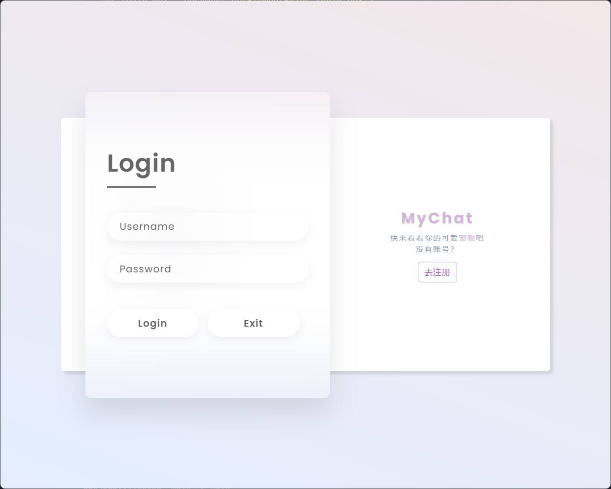
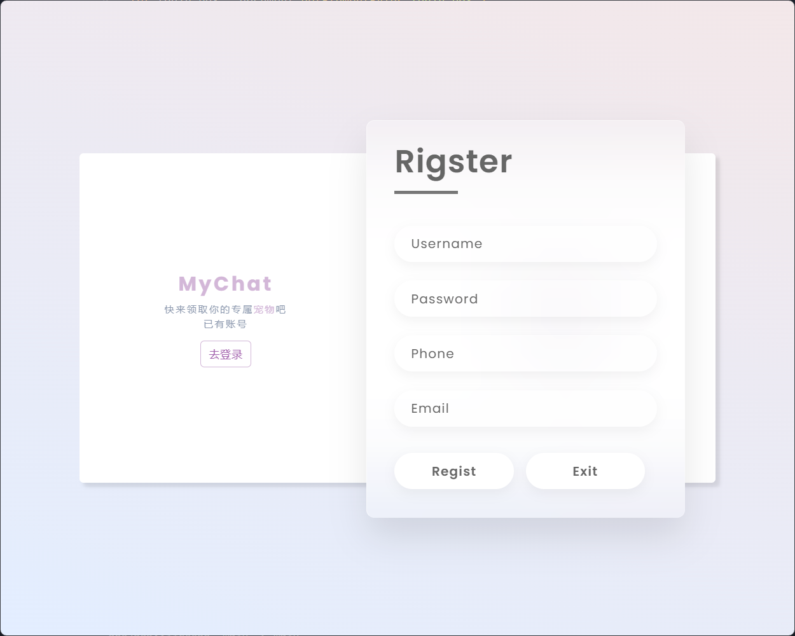
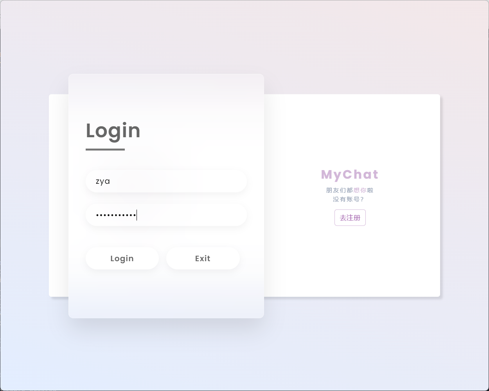
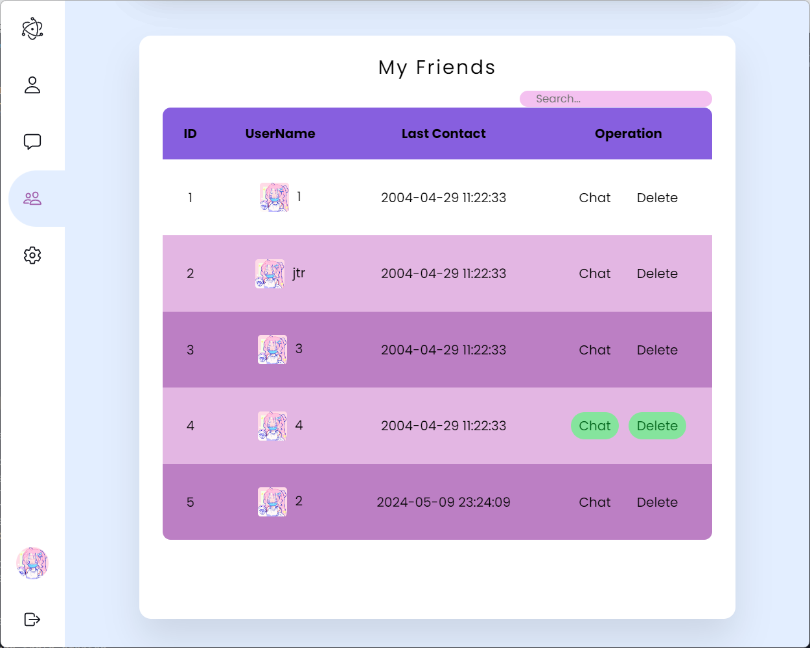
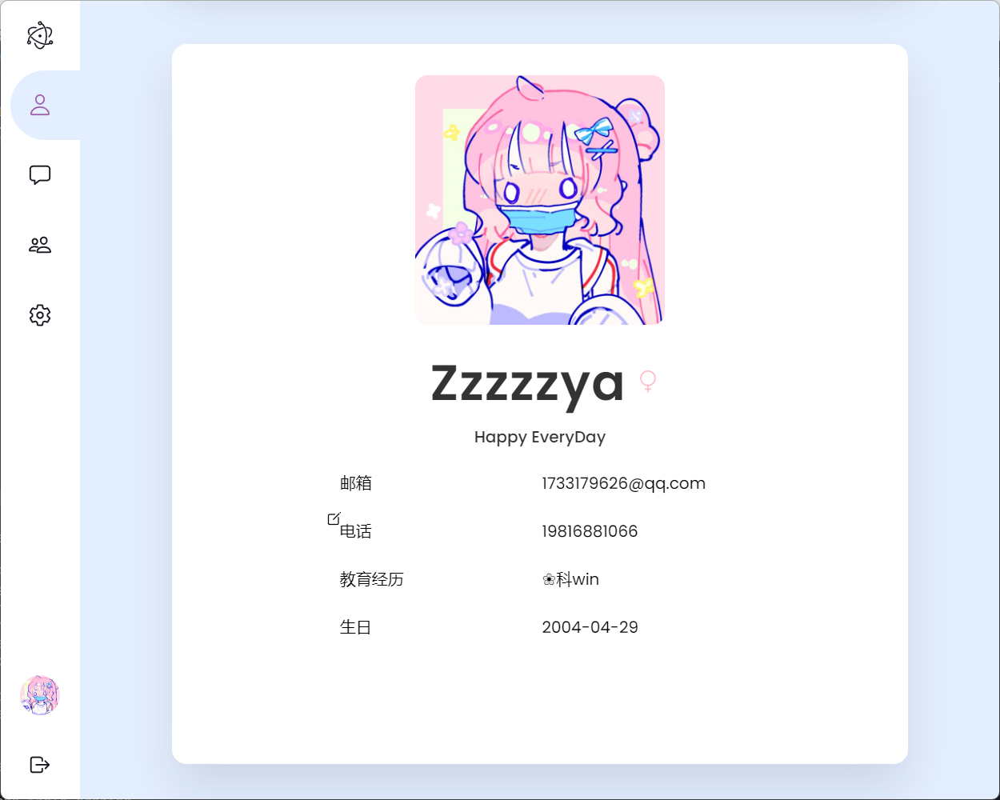
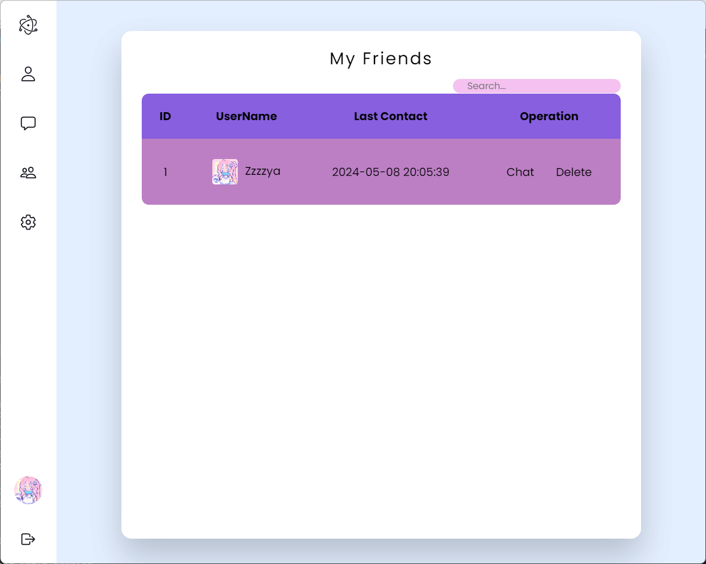
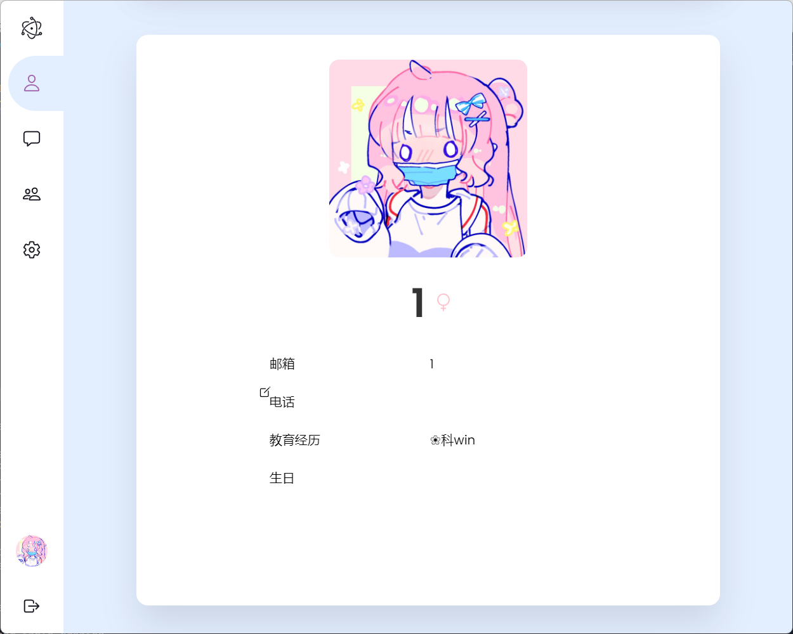

# MyChat-Client
MyChat-Client by electron

[bilibili视频演示](https://www.bilibili.com/video/BV1ny411Y7DJ/?spm_id_from=333.999.0.0&vd_source=f9105755833a175d6cfb9429d860f415)

对应的后端代码详见 [MyChat](https://github.com/Zzzzzya/MyChat)

# 前置环境配置

- Node.js + npm

## Electon环境创建
 ```
 npm install
 npm install electron --save-dev
 npm install @grpc/grpc-js
 npm install sqlite3
 ```
 ```
 运行：
 npm start
 ```

 # 进展记录
 ## Day1 2024.4.24
 >配置好grpc，制作完成登录界面，成功与LoginServer交互

[Day1 - video](src/videos/Day1.mp4)

## Day2 2024.4.25
>修改了登录界面的样式，增加了注册页面。




- Bug && 解决记录
   
   点击“去注册” & “去登录” 按钮时，container进行左右的transform平移。
   而这会导致内容文本框的交互属性停留在原地

- 解决方案
  
  transformer时给container的宽度进行加减1，这样可以触发强制重绘

## Day3 2024.4.27
>完善了登录和注册界面功能4

## Dayxx 2024.5.9
> 完成从服务器获取个人信息 + 好友列表 => 存入本地sqlite => 显示
> 演示如下： 分别使用zya 和 1 两个账号登录，可以看到获取到了对应的好友列表和个人信息






